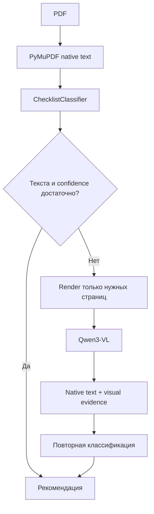
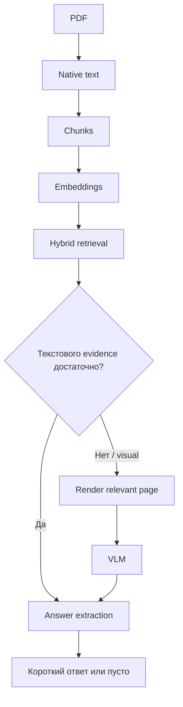

<!-- README.md -->

# TZ Checklist AI

`TZ Checklist AI` — FastAPI backend-сервис для анализа PDF ТЗ, автоматического выбора одного из пяти фиксированных чек-листов и последующего заполнения найденными в документе ответами.

Сервис не содержит frontend и предназначен для интеграции с 1С / Telegram.

## Поддерживаемые чек-листы

- УУТЭ;
- ИТП;
- МКБИ;
- СПД;
- АУПТ.

Пользователь загружает PDF. Сервис предлагает чек-лист, пользователь подтверждает рекомендацию либо выбирает другой. После анализа формируется PDF:

| № | Вопрос | Ответ |
|---|---|---|

Если подтвержденного evidence нет, ответ остается пустым.

## Архитектурные принципы

Проект использует SOLID, Dependency Injection, Ports & Adapters, Composition Root, Repository Pattern, Use Case Pattern и Strategy/Fallback Pattern.

Pydantic v2 используется для:
- Settings;
- YAML-определений чек-листов;
- доменных моделей;
- VLM JSON;
- результатов классификации;
- health/readiness;
- будущих retrieval/extraction DTO.

## Модели

На этапе 2 реально используется только одна generative/VLM-модель:

```dotenv
OLLAMA_VLM_MODEL=qwen3-vl:8b-instruct
```

Модель настраивается через `.env` и может быть заменена без изменения application layer.

`qwen3-embedding:4b` зарезервирована для этапа 3 (semantic retrieval).

`qwen3.8:27b` не является обязательной зависимостью проекта и сейчас не используется.

## PDF: native text first

Все страницы заранее в изображения не переводятся.



VLM используется как targeted fallback:
- скан / пустой текстовый слой;
- слабый text layer;
- низкая confidence;
- в будущем — релевантный чертеж, схема или сложная таблица.

## Будущий анализ вопросов



## GPU

На RTX 3090 24 GB задачи проекта выполняются последовательно:

```dotenv
GPU_TASK_CONCURRENCY=1
VLM_PAGES_IN_FLIGHT=1
OLLAMA_KEEP_ALIVE=1m
```

`keep_alive=1m` передается в каждый VLM-запрос проекта.

## Чек-листы

Пять постоянных XLSX нормализованы в YAML:

```text
resources/checklists/
├── catalog.yaml
├── manifest.yaml
└── definitions/
    ├── uute.yaml
    ├── itp.yaml
    ├── mkbi.yaml
    ├── spd.yaml
    └── aupt.yaml
```

Количество вопросов:
- UUTE — 41;
- ITP — 75;
- MKBI — 82;
- SPD — 25;
- AUPT — 30.

ИТП сохраняет два исходных sheet. Ошибки исходных XLSX не исправляются скрытно и фиксируются в manifest.

## Структура

```text
tz-checklist-ai/
├── app/
│   ├── api/
│   ├── core/
│   ├── domain/
│   ├── application/
│   │   ├── ports/
│   │   ├── services/
│   │   └── use_cases/
│   ├── infrastructure/
│   │   ├── ai/
│   │   ├── checklists/
│   │   └── pdf/
│   └── worker/
├── resources/checklists/
├── tests/
│   ├── unit/
│   ├── integration/
│   ├── acceptance/
│   └── fixtures/private/
├── scripts/
├── Dockerfile
├── compose.yaml
├── pyproject.toml
├── .env.example
└── README.md
```

## План

1. FastAPI, DI, healthchecks, Docker, scripts, базовые тесты.
2. Пять чек-листов, native-text-first PDF analysis, targeted VLM fallback, выбор и подтверждение чек-листа.
3. RabbitMQ/GPU queue, embeddings, hybrid retrieval, extraction, PDF-отчет.
4. Один endpoint, state machine, E2E/acceptance и финальная документация.

## Тестирование

Все проверки:

```bash
./scripts/test.sh
```

Этап 2 автоматически проверяет:
- Pydantic-валидацию чек-листов;
- количества вопросов;
- два sheet ИТП;
- native text extraction;
- targeted rendering;
- отсутствие VLM при уверенной native-классификации;
- VLM fallback при слабом text layer;
- последовательные VLM-вызовы;
- `keep_alive=1m`;
- наличие configured VLM;
- 5/5 классификацию реальных PDF.

PDF из `tests/fixtures/private/` не коммитятся.

## Запуск

```bash
./scripts/run.sh
```

Остановка:

```bash
./scripts/stop.sh
```
