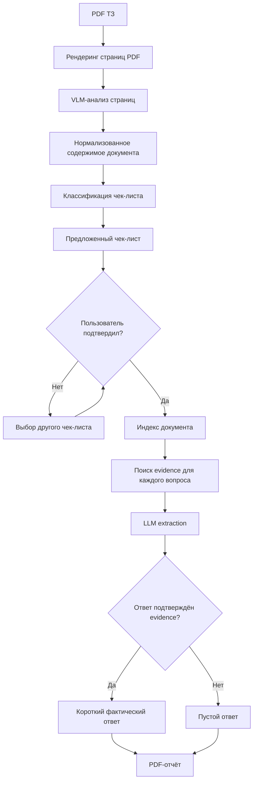
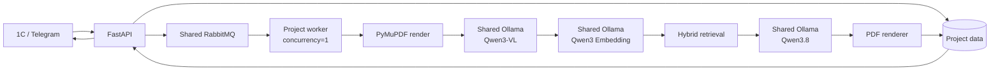
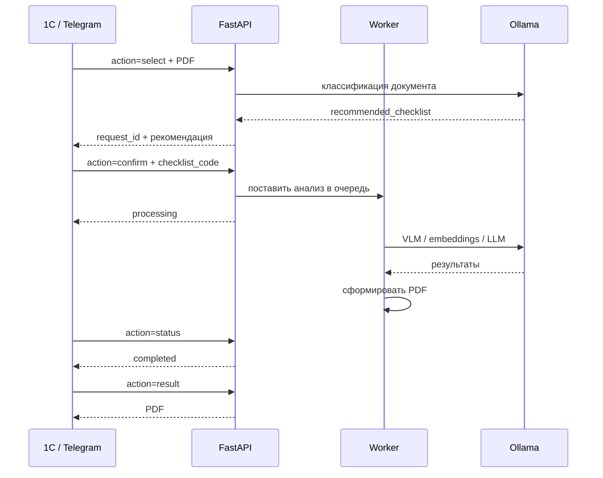

<!-- README.md -->

# TZ Checklist AI

`TZ Checklist AI` — backend-сервис на FastAPI для анализа PDF-файлов технического задания, автоматического выбора одного из фиксированных чек-листов и заполнения найденными в ТЗ ответами.

Сервис предназначен для интеграции с внешним интерфейсом, например 1С или Telegram-ботом. Собственного frontend у проекта нет.

## Что делает сервис

Пользователь передаёт PDF ТЗ. Сервис определяет наиболее подходящий чек-лист из фиксированного набора:

- УУТЭ;
- ИТП;
- МКБИ;
- СПД;
- АУПТ.

После подтверждения выбранного чек-листа сервис анализирует документ, ищет фактические ответы на вопросы и формирует PDF-отчёт в формате:

| № | Вопрос | Ответ |
|---|---|---|

Если достоверный ответ в ТЗ не найден, ячейка ответа остаётся пустой.

LLM не должна дополнять документ собственными знаниями. Ответ формируется только на основании найденных в загруженном ТЗ данных.

## Архитектурные принципы

Проект строится с использованием:

- SOLID;
- Dependency Injection;
- Ports & Adapters;
- разделения domain/application/infrastructure/API;
- project-specific worker;
- shared Ollama;
- shared RabbitMQ;
- private project network и shared `ai-shared`.

На сервере используется одна NVIDIA GeForce RTX 3090 с 24 ГБ VRAM, поэтому GPU-задачи проекта сериализуются. Планируемая конкуренция GPU worker — `1`.

Модели Ollama:

- LLM: `qwen3.8:27b`;
- VLM: `qwen3-vl:8b-instruct`;
- embeddings: `qwen3-embedding:4b`.

Для запросов проекта используется `OLLAMA_KEEP_ALIVE=1m`, чтобы модель после завершения работы могла быть выгружена из VRAM примерно через одну минуту.

## Бизнес-логика



## Процесс обработки



OCR-движок в pipeline не используется. Страницы PDF рендерятся в изображения и анализируются VLM. Нативный текст PDF может использоваться как дополнительный источник контекста, но не заменяет VLM-анализ страниц.

## API-сценарий

Планируется один endpoint:

```text
POST /api/v1/tz-check
```

Операция определяется полем `action`.

Поддерживаемые действия:

```text
select
confirm
status
result
```

Логика взаимодействия:



## Структура проекта

```text
tz-checklist-ai/
├── app/
│   ├── main.py
│   ├── api/
│   │   ├── dependencies.py
│   │   └── v1/
│   │       ├── router.py
│   │       ├── schemas.py
│   │       └── tz_check.py
│   ├── core/
│   │   ├── config.py
│   │   ├── logging.py
│   │   └── container.py
│   ├── domain/
│   │   ├── entities.py
│   │   ├── enums.py
│   │   ├── models.py
│   │   └── exceptions.py
│   ├── application/
│   │   ├── ports/
│   │   ├── services/
│   │   └── use_cases/
│   ├── infrastructure/
│   │   ├── ai/
│   │   ├── pdf/
│   │   ├── retrieval/
│   │   ├── checklists/
│   │   ├── reports/
│   │   ├── persistence/
│   │   └── queue/
│   └── worker/
├── resources/
│   └── checklists/
│       ├── catalog.yaml
│       ├── manifest.yaml
│       ├── definitions/
│       └── source/
├── tests/
│   ├── unit/
│   ├── integration/
│   ├── acceptance/
│   └── fixtures/
├── scripts/
│   ├── test.sh
│   ├── run.sh
│   ├── stop.sh
│   ├── validate_checklists.py
│   └── smoke_test.py
├── docs/
├── Dockerfile
├── compose.yaml
├── pyproject.toml
├── .env.example
├── .gitignore
├── .dockerignore
└── README.md
```

## План разработки

1. Базовый FastAPI-проект, конфигурация, DI, healthchecks, Docker, scripts и тестовая инфраструктура.
2. Нормализация пяти чек-листов, VLM-разбор PDF и автоматический выбор чек-листа с подтверждением пользователя.
3. Очередь GPU-задач, embeddings, retrieval, LLM-extraction, валидация ответов и формирование PDF.
4. Единый endpoint, state machine, полные acceptance/E2E-тесты на пяти предоставленных парах ТЗ ↔ чек-лист и финальная документация.

## GPU и VRAM

На RTX 3090 одновременно не следует независимо запускать большие LLM/VLM-задачи.

Для проекта используются настройки:

```dotenv
GPU_TASK_CONCURRENCY=1
VLM_PAGES_IN_FLIGHT=1
OLLAMA_KEEP_ALIVE=1m
```

Project-specific worker получает GPU-задачи через shared RabbitMQ и обрабатывает их последовательно.

Это ограничивает конкуренцию внутри `tz-checklist-ai`. Shared Ollama остаётся общей инфраструктурой, поэтому другие проекты также могут влиять на использование VRAM.

## Запуск

Первый запуск:

```bash
cp .env.example .env
chmod +x scripts/*.sh
./scripts/run.sh
```

Обычный запуск:

```bash
./scripts/run.sh
```

Остановка:

```bash
./scripts/stop.sh
```

## Тестирование

Все тесты проекта запускаются одной командой:

```bash
./scripts/test.sh
```

Скрипт сам:

- проверяет `docker compose config`;
- собирает тестовый image;
- запускает Ruff;
- запускает весь pytest test suite.

Ручная проверка отдельных функций не должна требоваться, если это можно выразить автоматическим тестом.

## Проверка API

После запуска:

```bash
curl -fsS http://localhost:8110/health/live
curl -fsS http://localhost:8110/health/ready
```

## Shared infrastructure

Приложение не создаёт собственные Ollama и RabbitMQ.

Используются:

```text
Ollama:   http://ollama:11434
RabbitMQ: rabbitmq:5672
Network:  ai-shared
```

RabbitMQ должен использовать отдельные user и vhost проекта.

## Git

Основной production/private repository:

```text
neo-term-it/tz-checklist-ai
```

Контрольный repository:

```text
Amadu-A/tz-checklist-ai
```

Секреты, `.env`, токены и пароли в Git не коммитятся.
