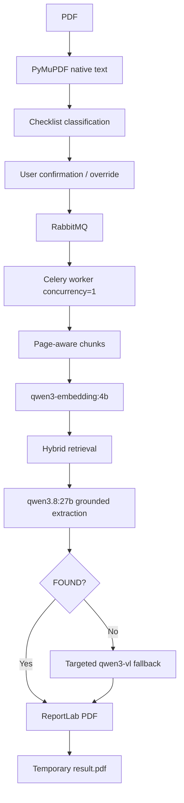

<!-- Readme.md -->

# TZ Checklist AI

`TZ Checklist AI` — backend-сервис на FastAPI для анализа PDF технических заданий, автоматической рекомендации одного из пяти фиксированных чек-листов и формирования заполненного PDF-отчёта.

Сервис предназначен для интеграции с 1С / Telegram и не содержит собственного прикладного frontend.

## Что делает сервис

Полный lifecycle:

1. пользователь передаёт PDF ТЗ;
2. сервис native-first анализом рекомендует чек-лист;
3. пользователь подтверждает рекомендацию либо выбирает другой чек-лист;
4. задача отправляется в project-specific RabbitMQ queue;
5. worker последовательно выполняет retrieval и grounded answer extraction;
6. при необходимости используется targeted VLM fallback только для выбранных страниц;
7. формируется PDF с тремя колонками: `№ | Вопрос | Ответ`;
8. исходный PDF удаляется после обработки;
9. PDF-результат хранится временно до первого успешного получения;
10. после `action=result` серверная копия результата и metadata job удаляются.

Если подтверждённого evidence для вопроса нет, колонка ответа остаётся пустой.

## Поддерживаемые чек-листы

| Код | Чек-лист | Вопросов |
|---|---|---:|
| `UUTE` | УУТЭ | 41 |
| `ITP` | ИТП | 75 |
| `MKBI` | МКБИ | 82 |
| `SPD` | СПД | 25 |
| `AUPT` | АУПТ | 30 |

## Публичный API

Используется один endpoint:

```text
POST /api/v1/tz-check
```

Endpoint работает как state machine через поле `action`.

### `action=select`

Передаётся `action=select` и `file=<PDF>`. Ответ содержит `request_id`, `recommended_checklist`, `confidence`, ranking пяти чек-листов и источник классификации.

### `action=confirm`

Передаётся `action=confirm`, `request_id`, `checklist_code`. Код может совпадать с рекомендацией либо быть пользовательским override.

### `action=status`

Передаётся `action=status`, `request_id`.

Возможные состояния:

```text
awaiting_confirmation
queued
processing
completed
failed
```

### `action=result`

Передаётся `action=result`, `request_id`.

При `completed` возвращается `application/pdf`. Результат одноразовый: после успешного чтения PDF в HTTP response backend удаляет `/data/jobs/<request_id>/result.pdf` и metadata задания. Повторный `action=result` возвращает `404`.

## Архитектура

Проект использует SOLID, Dependency Injection, Ports & Adapters, Composition Root, Repository Pattern, Use Case / Application Service Pattern, Strategy / targeted fallback и Pydantic v2.



## AI-модели

```dotenv
OLLAMA_EMBEDDING_MODEL=qwen3-embedding:4b
OLLAMA_LLM_MODEL=qwen3.8:27b
OLLAMA_VLM_MODEL=qwen3-vl:8b-instruct
OLLAMA_KEEP_ALIVE=1m
```

Native text является основным источником. VLM используется только для слабых или visual-страниц. Embeddings документа вычисляются один раз на job и существуют только в RAM.

Для `FOUND` требуется реальный `supporting_text`, достаточная confidence и соответствие чисел evidence. Иначе в итоговом PDF ответ остаётся пустым.

## GPU policy

```dotenv
GPU_TASK_CONCURRENCY=1
VLM_PAGES_IN_FLIGHT=1
```

Worker работает с `--concurrency=1` и `--prefetch-multiplier=1`.

Shared Ollama внутри Docker network:

```text
http://ollama:11434
```

## RabbitMQ

```dotenv
RABBITMQ_VHOST=tz_checklist_ai
RABBITMQ_USER=tz_checklist_ai
CELERY_QUEUE_NAME=tz-checklist-ai
```

Пароль хранится только в `.env` и не коммитится.

## Политика хранения

Backend не является архивом документов.

```text
select
  -> /data/jobs/<job_id>/input.pdf

worker завершён
  -> input.pdf удалён

completed
  -> /data/jobs/<job_id>/result.pdf

первый успешный action=result
  -> bytes возвращены клиенту
  -> result.pdf удалён
  -> metadata удалена
```

Celery Beat дополнительно удаляет просроченные jobs, старые filesystem orphan directories и stale `*.tmp`.

Извлечённый текст, chunks, embeddings, evidence и ответы не сохраняются в persistent storage.

## Реальные тестовые PDF

Реальные документы кладутся только локально:

```text
tests/fixtures/private/
```

Они исключены из Git и Docker build context.

Проверить доступные PDF:

```bash
find tests/fixtures/private -maxdepth 1 -type f -iname '*.pdf' -print
```

## Настройка `.env`

```bash
bash ./scripts/sync-env.sh
```

Существующие значения и секреты не перезаписываются.

## Запуск

```bash
./scripts/run.sh
```

Проверка:

```bash
docker compose ps
docker compose logs --tail=200 api
docker compose logs --tail=200 worker
docker compose logs --tail=200 beat
```

Остановка:

```bash
./scripts/stop.sh
```

## Healthchecks и Swagger

На сервере:

```text
http://127.0.0.1:8110/health/live
http://127.0.0.1:8110/health/ready
```

При `API_BIND_IP=0.0.0.0` Swagger доступен по LAN:

```text
http://<SERVER_IP>:8110/docs
```

Например:

```text
http://192.168.10.150:8110/docs
```

Без reverse proxy / TLS используется именно `http://`, а не `https://`.

Swagger удобен для `select`, `confirm` и `status`. Browser file chooser видит файлы на компьютере, где открыт браузер. PDF, существующий только на Linux-сервере в `tests/fixtures/private/`, через Windows browser file chooser напрямую выбрать нельзя.

Для `action=result` надёжнее использовать `scripts/e2e-real.sh`, потому что endpoint возвращает бинарный PDF.

## Полный E2E на реальном PDF

Сначала:

```bash
./scripts/run.sh
```

Затем:

```bash
./scripts/e2e-real.sh "tests/fixtures/private/ИМЯ_ФАЙЛА.pdf"
```

Вторым аргументом можно передать override:

```bash
./scripts/e2e-real.sh "tests/fixtures/private/ИМЯ_ФАЙЛА.pdf" ITP
```

Скрипт автоматически выполняет `select -> confirm -> status -> result`, сохраняет клиентскую копию PDF, проверяет повторный `result=404`, отсутствие `/data/jobs/<request_id>` и отсутствие metadata.

Результат сохраняется в:

```text
artifacts/e2e/
```

Это клиентская копия, а не backend retention. После проверки её можно удалить:

```bash
rm -f artifacts/e2e/*.pdf
```

## Почему результат можно открыть после удаления backend-файла

Удаляется только временная серверная копия.

```text
server result.pdf
      |
      v
read bytes successfully
      |
      +----> HTTP response ----> клиент сохраняет report.pdf
      |
      v
delete backend result.pdf
delete job metadata
```

Поэтому E2E-скрипт получает весь PDF по HTTP и сохраняет его в `artifacts/e2e/`, хотя `/data/jobs/<request_id>/result.pdf` уже удалён.

## Автоматические тесты

```bash
./scripts/test.sh
```

Проверяются Docker Compose, Ruff, unit/integration tests, live Ollama, live RabbitMQ, retrieval, grounded extraction, ReportLab, privacy/retention failure paths и unified API state machine.

## Финальная эксплуатационная проверка

```bash
git pull --ff-only
bash ./scripts/sync-env.sh
./scripts/test.sh
./scripts/run.sh
docker compose ps
./scripts/e2e-real.sh "tests/fixtures/private/ИМЯ_ФАЙЛА.pdf"
docker compose logs --tail=200 worker
```

Для полной acceptance-проверки повторить E2E для `UUTE`, `ITP`, `MKBI`, `SPD`, `AUPT`.

После успешного реального E2E сервис готов к интеграции с внешним клиентом 1С / Telegram.
